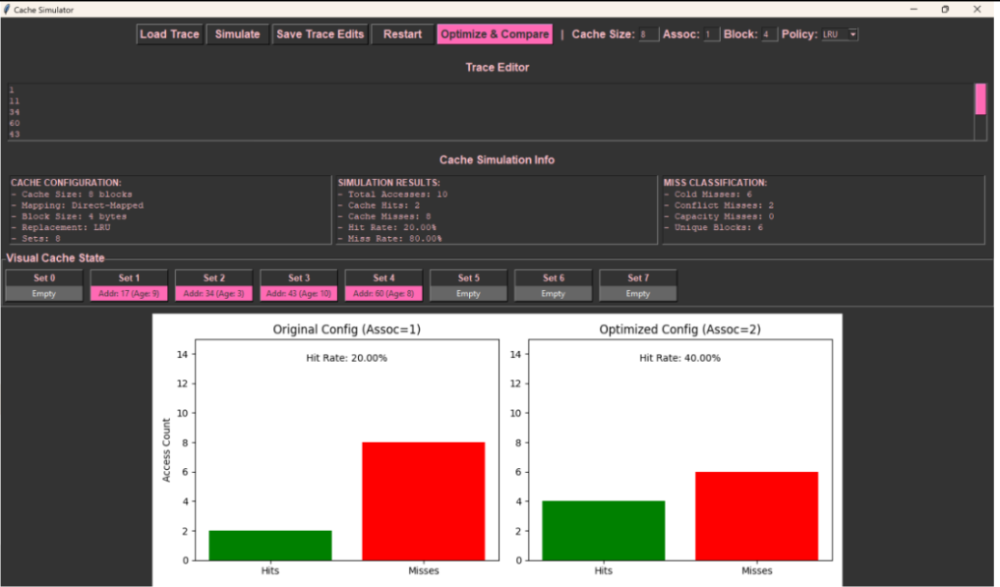

# Cache Simulator

A visual cache simulator implemented in Python using Tkinter. This tool helps in analyzing CPU cache behavior under different configurations and replacement policies.


## Features

- **Configurable Cache Settings**: Cache size, associativity, block size, and replacement policy.  
- **Supported Policies**: LRU, FIFO, and Random.  
- **Interactive GUI**: Built with Tkinter, allows loading and editing memory traces.  
- **Real-Time Visualization**: Live updates of cache set contents after simulation.  
- **Miss Classification**: Cold, Conflict, and Capacity misses breakdown.  
- **Graphical Summary**: Hit/miss statistics and miss types represented using charts.  
- **Optimization Tool**: Compares associativities to identify the best-performing configuration.
  

## Project Structure

```
Cache-Simulator-GUI/
├── assets/                 #sample output screenshots
│   ├── Simulation.png  
│   ├── Optimization.png  
│   └── Optimization_notification.png  
├── cache_simulator.py      # Main GUI & simulator logic  
├── requirements.txt        # List of Python dependencies  
└── README.md               # Project documentation  
```


## Usage

1. **Install dependencies**:
   ```bash
   pip install -r requirements.txt
   ```

2. **Run the application**:
   ```bash
   python cache_simulator.py
   ```

3. **Simulate**:
   - Load a memory trace file (plain text, one address per line).  
   - Configure cache settings in the GUI.  
   - Click **Simulate** to view hits/misses and charts.  
   - Use **Optimize & Compare** to find the best associativity.

  
## Sample Output

### Simulation Results  


### Optimization  


### Comparison Results  



## Contributors:

- [@nehanpnair](https://github.com/nehanpnair)
- [@Niharika-Saha](https://github.com/Niharika-Saha) 
- [@Niharika-Paul](https://github.com/Niharika-Paul)

